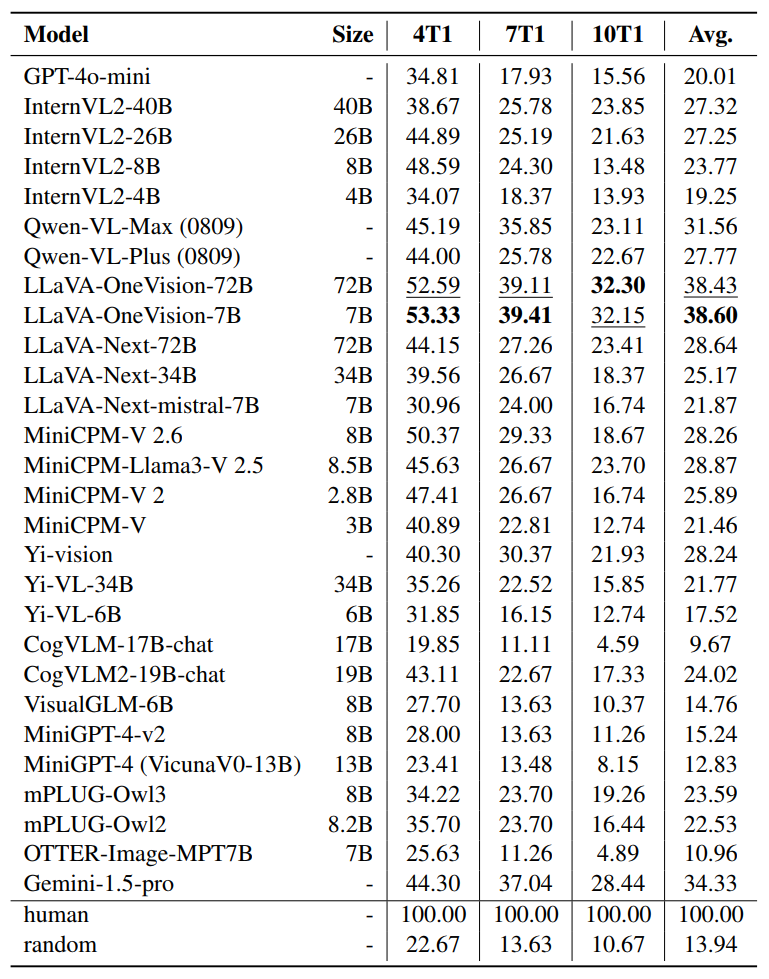

# AssoCiAm: A Benchmark for Evaluating Association Thinking while Circumventing Ambiguity

This is the official repository for our paper "AssoCiAm: A Benchmark for Evaluating Association Thinking while Circumventing Ambiguity".  Our paper has been accepted to **EMNLP '25 main track** and the benchmark has been released in [[Google Drive]](https://drive.google.com/drive/folders/1pvpfOMA6HLq2x3EEXnVhXFo_FY6VdNGo?usp=drive_link) [[Hugging Face]](https://huggingface.co/datasets/chandl2/AssoCiAm)

## Environment Setup

Create a new Python virtual environment and install the required dependencies for evaluation.

``` bash
conda create -n AssoCiAm python=3.10
conda activate AssoCiAm
pip install -r requirements.txt
```

After setting up the environment, install additional packages required by the model you want to evaluate.

## Testing on AssoCiAm

#### Data preparation

The benchmark can be downloaded in  in [[Google Drive]](https://drive.google.com/drive/folders/1pvpfOMA6HLq2x3EEXnVhXFo_FY6VdNGo?usp=drive_link) [[Hugging Face]](https://huggingface.co/datasets/chandl2/AssoCiAm). After downloading, place the `benchmark/` and ``prompt_template/`` folder in the project root directory.

**Data structure from the download:**

```
AssoCiAm/
├── benchmark/
└── prompt_template/
```

Then, clone the repository and enter the project directory:

```bash
git clone https://github.com/lyf15/AssoCiAm.git
cd AssoCiAm
```

After setup, the complete directory structure should look like this:

``` 
AssoCiAm/
├── benchmark/
│   ├── 4T1subtask/
│   ├── 7T1subtask/
│   └── 10T1subtask/
├── prompt_template/
├── results/    # automated made by scorer.py
├── scores/     # automated made by scorer.py
├── model.py
└── scorer.py
```

#### Test your model

To evaluate your model, you need to implement the required interface in `model.py` as follows:

  ```python
  def load():
      # Load your model and move it to the appropriate device (e.g., GPU or CPU).
      # The loaded model should be defined as a global variable so that it can be
      # accessed by the `response` function.
      ...
  
  def response(img_path, prompt):
      # Use your model to generate an answer based on the given image (img_path)
      # and prompt. The returned answer must be a string such as "A", "B", "C", ...
      ...
  
  ```

Once `model.py` is correctly implemented, you can run the following command to test your model:

```bash
python scorer.py --subtask SUBTASK_ID --filename FILENAME --model_name MODEL_NAME
```

**Arguments:**

- `--subtask` (`-s`): Choose one of the benchmark subtasks (`4`, `7`, or `10`), corresponding to `4T1subtask`, `7T1subtask`, or `10T1subtask`.
- `--filename` (`-f`): Specify the name for saving the test results and scores.
- `--model_name` (`-m`): Provide a readable name for your model (default: `"the model"`).

**Example:**

```bash
python scorer.py -s 10 -f model1 -m model1
```

This command will evaluate `model1` on the **10T1subtask**. 

After execution, `scorer.py` automatically generates the following output files:

**Output files produced by `scorer.py`:**

`./results/10T1subtask/model1.json` — model predictions

```json
{
    "model1": {
        "1": "C",
        "2": "A",
        "...": "..."
    }
}
```

`./scores/10T1subtask/model1.json` — evaluation scores

```json
{
    "model1": 10.00
}
```

**Additional Usage: Evaluate Existing Results (`-y1`)**

If you have already generated the model prediction files in `./results/mT1subtask`, you can directly evaluate them **without re-running the model** by using the `-y1` flag.

**Command:**

```
python scorer.py -s SUBTASK_ID -f FILENAME -y1
```

**Example:**

```
python scorer.py -s 10 -f model1 -m model1 -y1
```

This command will load the existing results from `./results/10T1subtask/model1.json`, compare them with the ground truth, and save the evaluation scores to `./scores/10T1subtask/model1.json`.

> **Note:** Be careful not to reuse an existing filename (e.g., `model1`), as the new results or scores will **overwrite** files with the same name.

## Results


